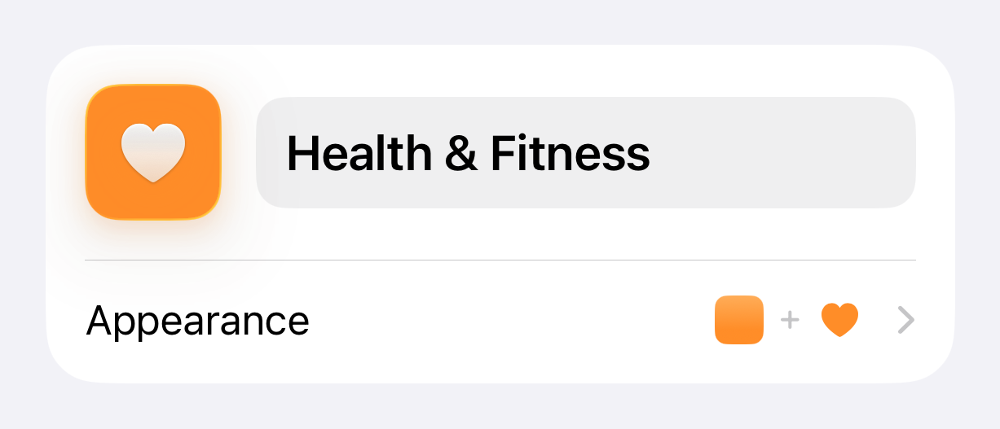
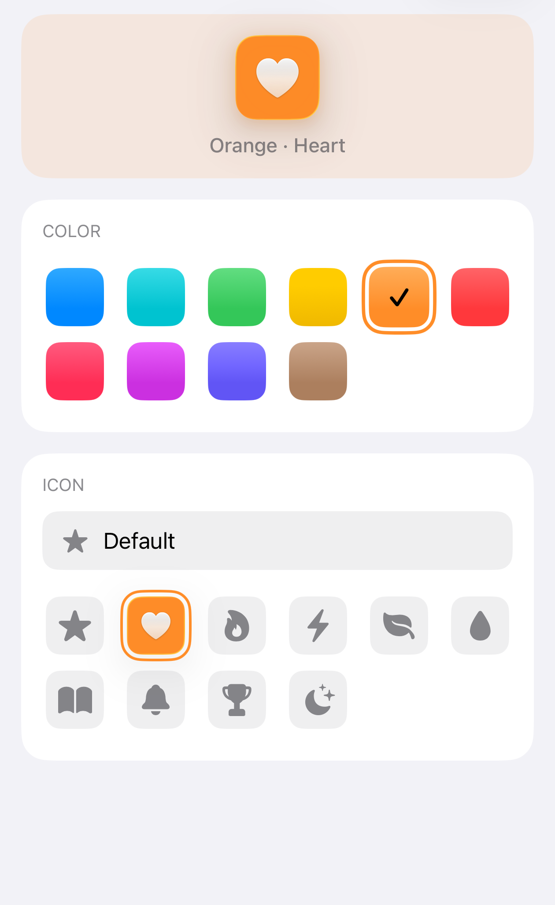
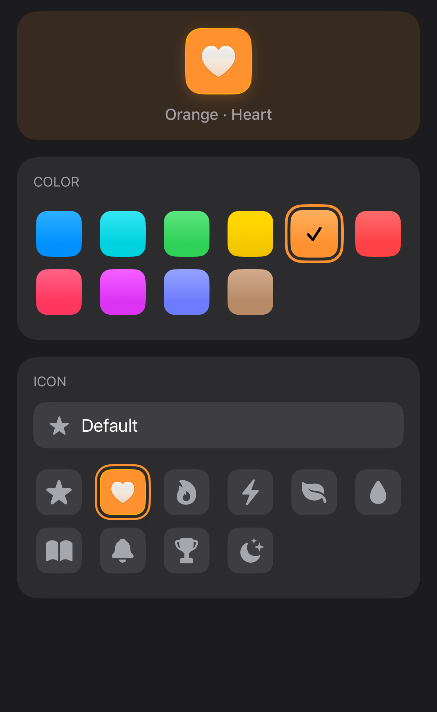
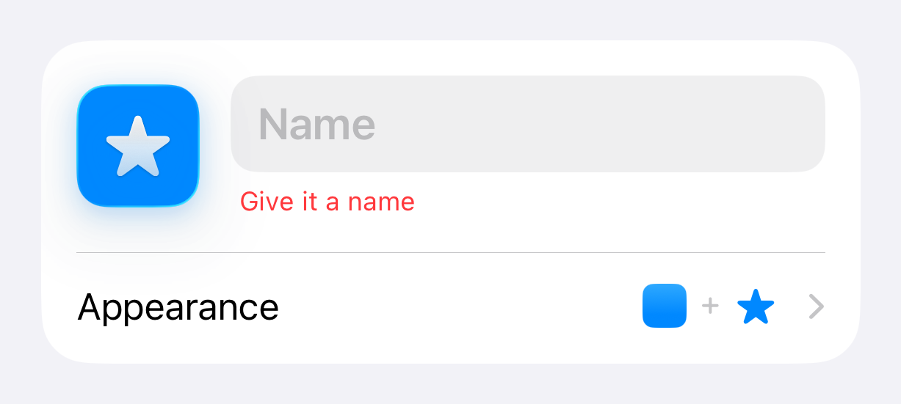

# IdentityKit

**The "enter a name, pick a color, pick an icon" unit for SwiftUI — one card, one sheet, your palette.**

   

<picture>
  <source media="(prefers-color-scheme: dark)" srcset="Assets/identity-card-dark.png">
  
</picture>

## What is it?

A small SwiftUI package for editing an entity's *identity* — name, color, and
icon — the way habit trackers, tag editors, and folder/board managers all end
up needing. It ships the whole flow, not just the grids:

| Symbol | Kind | Purpose |
|---|---|---|
| `IdentityCard` | `View` | Compact card: live icon preview + name field + one "Appearance" disclosure row. The common case. |
| `AppearancePickerSheet` | `View` | Full-height sheet with a live hero preview, `ColorGrid`, and `IconGrid` — color and icon in one step. |
| `ColorGrid` | `View` | Adaptive swatch grid with a contrast-aware selection checkmark. |
| `IconGrid` | `View` | Adaptive SF Symbol grid; only the selected tile renders as Liquid Glass. |
| `PaletteColor` / `IconOption` | `struct` | Your palette and icon catalog, described as plain value types with **stable string ids**. |
| `DefaultIconOption` | `struct` | An explicit "default / no icon" row for entities that fall back to a generic glyph. |
| `PreviewTileConfiguration` / `DefaultPreviewTile` | `struct` / `View` | The preview-tile customization point and its GlassIconKit-based default. |

Everything binds to **stable id strings** — the values you'd persist on a
model — so the kit never sees your color enum or icon enum, and renaming a
display title never invalidates stored data.

Tiles and swatches are styled by [GlassIconKit](https://github.com/bsurrey/GlassIconKit)'s shared
preferences (Candy Mode, Round Icons, gradients/shadows toggles), so the
picker previews exactly the tile the rest of your app will draw.

## What does it look like?

The combined picker — live hero preview, color grid, and icon grid with an
optional "Default" row — in one full-height sheet:

| Light | Dark |
|---|---|
|  |  |

Validation feedback surfaces right under the name field:



## How do I use it?

### Install

```swift
.package(url: "https://github.com/bsurrey/IdentityKit.git", from: "1.0.0")
```

### Describe your palette and icon catalog

Map whatever your app uses (an enum, a config file) to the kit's value types
once:

```swift
import IdentityKit

let palette: [PaletteColor] = [
    PaletteColor(id: "blue", color: .blue, title: "Blue"),
    PaletteColor(id: "sunset", color: Color(red: 1, green: 0.5, blue: 0.2), title: "Sunset"),
    // Optional: pass `contrastingForeground:` if you hand-tune contrast colors.
]

let icons: [IconOption] = [
    IconOption(id: "star", symbolName: "star.fill", title: "Star"),
    IconOption(id: "heart", symbolName: "heart.fill", title: "Heart"),
]
```

### Show the card

```swift
@State private var name = ""
@State private var colorID = "blue"     // what you persist
@State private var iconID = "star"      // what you persist

IdentityCard(
    name: $name,
    selectedColorID: $colorID,
    selectedIconID: $iconID,
    colors: palette,
    icons: icons,
    nameError: showError ? "Give it a name" : nil,
    namePlaceholder: "Name",
    appearanceTitle: "Appearance"
)
```

Or present just the picker:

```swift
.sheet(isPresented: $showPicker) {
    AppearancePickerSheet(
        colors: palette,
        icons: icons,
        selectedColorID: $colorID,
        selectedIconID: $iconID,
        fallbackSymbolName: "folder.fill",
        defaultIconOption: DefaultIconOption(id: "none")   // optional "no icon" row
    )
}
```

`DefaultIconOption` writes its `id` to the binding when chosen; whenever the
bound icon id matches no catalog entry, previews fall back to
`fallbackSymbolName` — so stale persisted ids degrade gracefully.

### Inject your own preview tile

The live preview (card header + sheet hero) defaults to a GlassIconKit tile.
If your app has its own icon component, inject it — the closure receives the
resolved color, symbol, and the metrics for the spot being rendered:

```swift
IdentityCard(
    name: $name,
    selectedColorID: $colorID,
    selectedIconID: $iconID,
    colors: palette,
    icons: icons
) { configuration in
    MyIconView(
        color: configuration.color,
        symbolName: configuration.symbolName,
        size: configuration.size,          // 56 in the card, 64 in the sheet hero
        iconSize: configuration.glyphSize  // 26 in the card, 32 in the sheet hero
    )
}
```

### Motion, haptics, and effects

- Selection animations respect the system **Reduce Motion** setting, and an
  app-level preference via `\.identityAnimationsEnabled`:

  ```swift
  IdentityCard(...)
      .environment(\.identityAnimationsEnabled, animationsPreference)
  ```

- Selection haptics use `sensoryFeedback`, gated the same way via
  `\.identityHapticsEnabled`.
- Tile shapes, glass finish, gradients, and shadows follow GlassIconKit's
  shared `@AppStorage` preferences (`IconStyle`, `VisualEffectStyle`) — wire
  those toggles once and both packages restyle together.

### Recents, persistence, and other side effects

The components mutate **only their bindings**. If you keep a "recently used
colors" list, layer it on from outside:

```swift
IdentityCard(...)
    .onChange(of: colorID) { _, new in recents.record(new) }
```

## Localization

The package's own strings — the "Color"/"Icon" section titles, the "Default"
icon row, and the "Done" button — ship localized in English, German, Spanish,
French, and Japanese via a bundled string catalog. Everything you pass in
(`title`, `namePlaceholder`, `appearanceTitle` as `LocalizedStringKey`;
`PaletteColor`/`IconOption` titles as display-ready strings) resolves against
*your* app's catalog.

## Requirements

- iOS 26+ (the icon tiles use GlassIconKit's Liquid Glass finish)
- Swift tools 6.2+, Swift 6 language mode
- Depends on [GlassIconKit](https://github.com/bsurrey/GlassIconKit)

## License

MIT — see [LICENSE](LICENSE).
